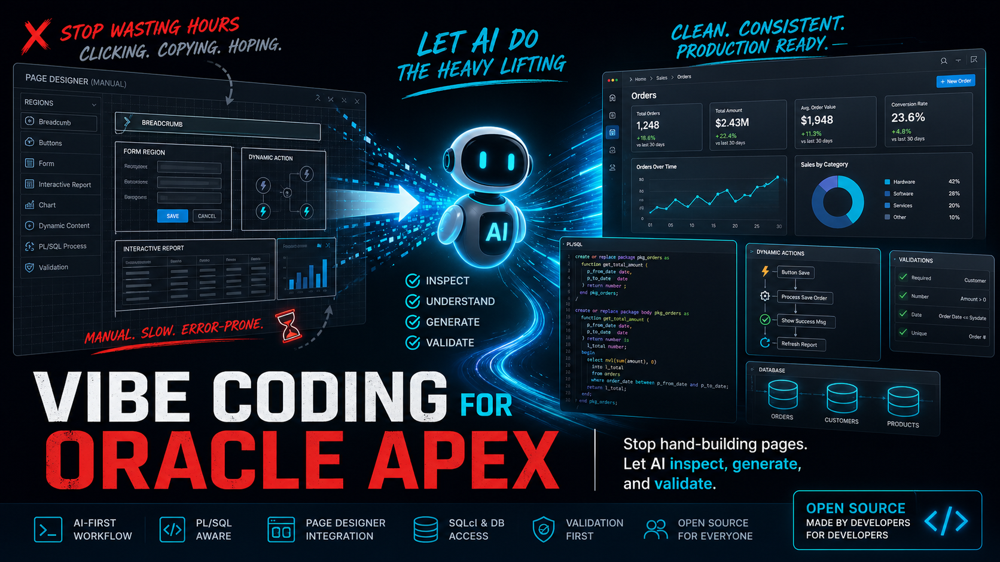

# Vibe Coding para Oracle APEX

> English version: [README.md](README.md)

<p align="center">
  
</p>

<p align="center">
  <strong>Pare de transformar cada ajuste APEX em uma caça ao tesouro no Page Designer.</strong><br>
  Dê para sua IA o manual operacional que ela precisa para analisar, gerar, validar e seguir os padrões do seu projeto.
</p>

> [!IMPORTANT]
> Ainda criando Oracle APEX como se fosse 2004?
>
> Ainda clicando por horas no Page Designer, copiando configuração de página antiga e torcendo para não esquecer uma Dynamic Action?
>
> Este é o ponto: **vibe coding para Oracle APEX, sem transformar sua aplicação em bagunça.**

Aqui, "vibe coding" não significa fazer no chute. Significa dar contexto, padrões do projeto, regras de validação e limites de segurança para o agente conseguir trabalhar bem em APEX sem improvisar a arquitetura.

| A rotina APEX antiga | Com estas AI skills |
| --- | --- |
| Abrir o Page Designer e copiar configuração na mão. | Pedir para o agente analisar bons exemplos e montar o plano da alteração. |
| Torcer para não esquecer Dynamic Action, condição de processo ou configuração de item. | Fazer validação, Session State, PL/SQL, exports e runtime entrarem no fluxo normal. |
| Deixar padrão de página, breadcrumb, ajuda, menu e dashboard na cabeça de alguém. | Versionar os padrões no perfil do projeto para todo desenvolvedor e agente seguirem o mesmo caminho. |
| Tratar export como backup de última hora. | Usar exports legíveis e perfis de projeto como contexto para um desenvolvimento APEX com IA mais seguro. |

**Resumindo:** pare de montar manualmente cada página repetitiva em APEX. Deixe um agente de IA analisar sua aplicação, entender seus padrões, gerar as partes repetitivas, validar o resultado e manter os padrões do projeto documentados.

<br>

<h3 align="center">Avaliações Totalmente Reais de Pessoas Altamente Qualificadas</h3>

<table>
  <tr>
    <td width="50%">
      <strong>"Se isso não ficar famoso, eu desinstalo meu navegador."</strong><br><br>
      ⭐⭐⭐⭐⭐<br>
      <sub>— Um Homem Anônimo Sob Pressão</sub>
    </td>
    <td width="50%">
      <strong>"Vim pelas AI skills e fiquei pela estabilidade emocional."</strong><br><br>
      ⭐⭐⭐⭐⭐<br>
      <sub>— Um Programador Surpreendentemente Equilibrado</sub>
    </td>
  </tr>
  <tr>
    <td width="50%">
      <strong>"Mais inspirador que um pôster motivacional em coworking."</strong><br><br>
      ⭐⭐⭐⭐⭐<br>
      <sub>— Um Especialista de Produtividade Totalmente Real</sub>
    </td>
    <td width="50%">
      <strong>"O tipo de coisa que faz você levantar, concordar lentamente e fingir que já tinha previsto."</strong><br><br>
      ⭐⭐⭐⭐⭐<br>
      <sub>— Um Visionário Tech, Supostamente</sub>
    </td>
  </tr>
  <tr>
    <td width="50%">
      <strong>"Não sei o que aconteceu, mas agora me sinto mais sênior."</strong><br><br>
      ⭐⭐⭐⭐⭐<br>
      <sub>— Desenvolvedor Junior</sub>
    </td>
    <td width="50%">
      <strong>"Tão bom que pensei por três segundos em atualizar meu título no LinkedIn."</strong><br><br>
      ⭐⭐⭐⭐⭐<br>
      <sub>— Um Profissional Ambicioso</sub>
    </td>
  </tr>
</table>

<br>

## O que é isto

Este é um conjunto reutilizável de skills para agentes de IA trabalhando com **Oracle APEX 24.2**.

Ele ajuda ferramentas como Codex, Claude Code e outros agentes a entender como trabalho APEX deve ser feito:

- ler a aplicação existente antes de alterar;
- respeitar Page Designer, SQLcl, Object Browser, packages PL/SQL, exports e validação runtime;
- evitar inventar tabelas, colunas, packages, regras de negócio ou padrões de tela;
- separar orientação APEX reutilizável dos padrões específicos do projeto;
- fazer a IA perguntar melhor e evitar erros bobos.

Não é mágica. Não substitui conhecer APEX. É um manual operacional para a IA que está ajudando você.

## Versões APEX suportadas

| Versão | Status |
| --- | --- |
| APEX 24.2 | Alvo principal |
| APEX 24.1 | Provavelmente compatível, valide exports e assinaturas de API |
| APEX 23.2 | Use com cautela e valide comportamento runtime |
| APEX anterior à 23 | Não recomendado sem adaptação |

## Para quem é

É especialmente útil se você é um desenvolvedor Oracle APEX que:

- conhece APEX, PL/SQL, SQL Developer e Page Designer;
- não quer virar especialista em terminal e Git só para usar IA;
- quer que a IA entenda como sua aplicação realmente funciona;
- quer que o time siga o mesmo padrão de página, menu, breadcrumb, ajuda, dashboard e validação;
- quer parar de repetir o mesmo trabalho manual de APEX todo dia.

Se você já domina GitHub, terminal e agentes de IA, também tem documentação manual. Comece por [docs/technical-overview.md](docs/technical-overview.md).

## O caminho recomendado

> [!TIP]
> **Regra número um: descreva mais, clique menos e escreva menos código repetitivo.**
>
> Se você está acostumado a abrir o Page Designer, copiar região, montar SQL na mão e ajustar propriedade por propriedade, essa é a mudança de mentalidade: comece explicando o problema de negócio, o padrão existente, as páginas de exemplo, as restrições e o que significa estar pronto.
>
> Sua ferramenta de IA deve virar o lugar onde o conhecimento do projeto é transferido, refinado e reutilizado. Quanto melhor você descreve a intenção, mais segurança e velocidade o agente tem para analisar, gerar, validar e documentar a mudança.

Para instalar, abra sua ferramenta de IA e diga:

```text
Quero usar estas Oracle APEX AI Skills no meu projeto:
https://github.com/andre-simplifica/oracle-apex-ai-skills

Instale para a ferramenta de IA que estou usando, crie o perfil do projeto e me explique o que preciso preencher.
Não sobrescreva nenhum perfil existente em .oracle-apex-ai/.
```

Depois deixe o agente guiar você.

A skill foi pensada para o agente instalar o núcleo reutilizável e depois ajudar você a documentar os padrões do seu próprio projeto.

No trabalho do dia a dia, continue falando com o agente assim:

```text
Preciso de uma nova página operacional para este fluxo de negócio.
Primeiro analise as páginas 45 e 46 porque elas são o padrão atual.
Não copie a página 12 porque ela é legado.
Use o perfil do projeto, identifique a package responsável, proponha os ajustes APEX e me diga o que precisa ser validado no runtime.
```

O objetivo não é virar especialista em decorar comando. O objetivo é deixar os padrões do projeto explícitos o suficiente para a IA e o time reutilizarem todos os dias.

## Com acesso ao banco fica muito melhor

A skill funciona mesmo se o agente só enxergar seus arquivos, exports, prints e mensagens de erro.

Mas o resultado é muito melhor quando sua ferramenta de IA também consegue acessar com segurança seu ambiente de desenvolvimento:

- SQLcl já configurado;
- VS Code com extensão Oracle/SQL Developer;
- SQL Developer com conexão funcionando;
- Oracle XE local;
- VM Oracle;
- Autonomous Database no OCI com wallet ou SQLNet;
- APEX DEV aberto no navegador.

Quando o agente consegue conectar no banco ou no ambiente DEV APEX, ele pode fazer muito mais do que escrever instruções. Ele pode ajudar a compilar packages, checar SQL, olhar Session State, validar runtime e reduzir a troca manual de informação.

Não cole senhas dentro da skill. Use o caminho seguro de conexão que você já tem localmente.

## Como usar depois de instalar

Você conversa naturalmente com sua IA:

```text
Use a skill oracle-apex-dev para analisar a página 120 antes de alterar qualquer coisa.
```

```text
Crie uma nova página APEX seguindo o padrão das páginas 45 e 46.
Não copie a página 12 porque ela é legado.
Use a skill oracle-apex-dev e leia o perfil do projeto primeiro.
```

```text
Revise este fluxo de upload.
Confira Page Designer, Session State, tabelas de staging, PL/SQL e runtime antes de propor correção.
```

```text
Use oracle-apex-export para orientar o export APEX em formato legível, split em múltiplos arquivos.
```

O ponto principal não é decorar comando. O ponto é dar contexto real do projeto e fazer o agente seguir os mesmos padrões do time.

## Deixe os padrões do projeto fora do núcleo

Este repositório contém o núcleo APEX reutilizável.

As regras específicas da sua aplicação ficam no seu próprio projeto, normalmente aqui:

```text
.oracle-apex-ai/project-profile.md
.oracle-apex-ai/app-patterns.md
.oracle-apex-ai/page-patterns/
```

É ali que você documenta coisas como:

- como a ajuda abre na sua aplicação;
- qual padrão de breadcrumb você usa;
- onde ficam os botões;
- quando usar Dynamic Content;
- quais packages são donas de dashboards, ajuda e lógica transacional;
- quais páginas são bons exemplos;
- quais páginas antigas não devem ser copiadas.

É isso que deixa a skill portátil. O núcleo funciona em vários projetos APEX, e cada projeto mantém sua própria personalidade e suas próprias regras.

## Ajude a melhorar

Se sua IA entender um padrão APEX melhor, um fluxo de validação mais seguro, uma forma melhor de exportar ou uma maneira mais clara de documentar padrões de projeto, peça para ela abrir um pull request aqui.

Essa é a ideia: um desenvolvedor melhora a skill, todo mundo aproveita.

Boas contribuições:

- guardrails genéricos de Oracle APEX;
- melhorias de SQLcl e export;
- checklists de validação melhores;
- templates de perfil mais claros;
- instruções que funcionem em vários agentes;
- documentação melhor em inglês e português.

Regras específicas de um projeto devem ficar no perfil do projeto, não no núcleo compartilhado.

## Checklist de contribuição segura

Antes de abrir uma issue ou pull request:

- remova senhas, tokens, wallets, chaves de API, strings de conexão e segredos OAuth;
- troque URLs privadas, hostnames, workspaces, schemas e aliases reais por placeholders;
- remova nomes de clientes, dados de produção, dumps, payloads e prints sensíveis;
- mantenha regras específicas da sua aplicação no seu próprio `.oracle-apex-ai/project-profile.md`;
- leia [SECURITY.md](SECURITY.md).

## Custo

Este repositório é gratuito e open source sob licença MIT.

Você paga apenas pela ferramenta ou infraestrutura que escolher usar:

- assinatura do Codex, Claude Code ou outra ferramenta de IA;
- consumo de tokens se integrar via API;
- custos normais do seu ambiente Oracle, OCI, banco, VM ou ambiente local.

A skill em si é só conteúdo versionado: Markdown, templates e scripts auxiliares.

## Instalação manual

Se quiser fazer manualmente:

```bash
git clone https://github.com/andre-simplifica/oracle-apex-ai-skills.git ~/.oracle-apex-ai-skills
bash ~/.oracle-apex-ai-skills/scripts/install_codex.sh
```

Para Claude Code:

```bash
bash ~/.oracle-apex-ai-skills/scripts/install_claude_code.sh
```

Dentro do seu projeto APEX:

```bash
bash ~/.oracle-apex-ai-skills/scripts/init_project_profile.sh
```

Para mais detalhes:

- [docs/install-codex.md](docs/install-codex.md)
- [docs/install-claude-code.md](docs/install-claude-code.md)
- [docs/technical-overview.md](docs/technical-overview.md)
- [docs/adapt-to-your-project.md](docs/adapt-to-your-project.md)

## Manter as skills atualizadas

Este repositório vai evoluir. Quando novos guardrails, exemplos ou referências entrarem aqui, atualize sua instalação local para sua ferramenta de IA usar a versão mais nova.

Peça para sua IA:

```text
Atualize minha instalação local das Oracle APEX AI Skills usando:
https://github.com/andre-simplifica/oracle-apex-ai-skills

Mantenha meus arquivos específicos do projeto em .oracle-apex-ai/ sem alterações.
Depois me explique o que mudou.
```

Se preferir fazer manualmente:

```bash
cd ~/.oracle-apex-ai-skills
bash scripts/update_core.sh
```

## O que está incluído

- `skills/oracle-apex-dev`: skill principal de desenvolvimento APEX.
- `skills/oracle-apex-export`: skill de export/snapshot APEX.
- `skills/oracle-apex-dev/references/`: referências detalhadas para REST, SQL/PLSQL, debugging, jobs, segurança e operações destrutivas.
- `templates/`: modelos de perfil de projeto.
- `scripts/`: instalação, atualização, criação de perfil e validação.
- `docs/`: guias para humanos.
- `docs/examples/`: exemplos fictícios seguros para copiar e adaptar.
- `SECURITY.md`: regras públicas de segurança para issues, PRs, prints, logs e exemplos.
- `.github/`: templates de issue e pull request.
- `CHANGELOG.md`: histórico público de mudanças.

## Licença

Licença MIT. Veja [LICENSE](LICENSE).
