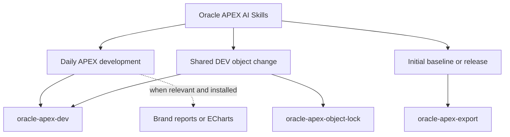

# Repository Architecture

The repository separates reusable workflows, deterministic project installation, database coordination, and application-specific standards.

## Core Skills

```text
skills/
  oracle-apex-ai-skills/
  oracle-apex-dev/
  oracle-apex-export/
  oracle-apex-object-lock/
```

`oracle-apex-ai-skills` is the main entry point. It interprets natural requests and routes only the required focused skills:



The kit targets Oracle APEX 24.2. Other versions require compatibility validation.

## Consuming-Project Installation

Codex repository skills are copied under:

```text
.agents/skills/
```

The project manager also writes:

```text
.oracle-apex-ai/installation-manifest.json
.oracle-apex-ai/upstream-lock.json
.oracle-apex-ai/compatibility.json
Util/scripts/manage_oracle_apex_ai_skills.py
```

These are managed files. Their checksums make local drift visible and prevent a silent overwrite during update.

## Project-Owned Standards

Each consuming project owns:

```text
.oracle-apex-ai/project-profile.md
.oracle-apex-ai/app-patterns.md
.oracle-apex-ai/page-patterns/
```

The profile defines application IDs, environments, safe connection commands, UI patterns, code ownership, official export paths, pending-migration paths, and release rules. The reusable core never replaces it.

This separation allows one application to use an Inline Dialog for help while another uses a drawer without turning either convention into a universal rule.

## Object-Lock Runtime

`oracle-apex-object-lock` ships database assets but does not install them automatically:

```text
DEV_OBJECT_LOCK
DEV_OBJECT_LOCK_UI1
DEV_OBJECT_LOCK_I1
VW_DEV_OBJECT_LOCK_ATIVO
VW_DEV_OBJECT_LOCK_RECENTE
PK_DEV_OBJECT_LOCK
```

The runtime is cooperative. It prevents compliant agents and developers from compiling the same live object concurrently, but it is not a hard DDL trigger.

File installation and database installation are intentionally separate:

```text
Install/update skills -> audit runtime -> request DEV authorization -> install/validate runtime
```

## Versioned Database Source

The first baseline and normal releases are different:

| Mode | APEX source | Database source |
| --- | --- | --- |
| Initial baseline | Complete application | Complete application-schema structure |
| Daily development | No official export by default | Canonical object edits + pending DDL |
| Release | Complete application | Changed objects + pending DDL |

Every structural change starts in `db/migrations/pending/` or the path defined by the project. Release generation does not mark migrations as applied.

## Optional Skills

The core works alone. When present:

- `build-apex-brand-reports` owns branded report/help/PDF/spreadsheet workflows;
- `oracle-apex-echarts` owns Apache ECharts region workflows.

The router may recommend them but must not require, copy, or update them as part of this kit.
